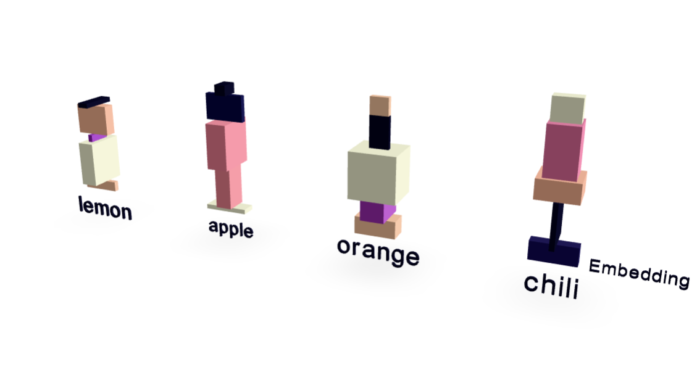

# Understanding Transformers Using A Minimal Example



This repository contains the data, code, and article source for the project hosted at [https://rti.github.io/gptvis/](https://rti.github.io/gptvis/).

## Introduction

The internal mechanisms of Large Language Transformer models (LLMs), particularly the flow of information through the layers and the operation of the attention mechanism, can be challenging to follow due to the vast amount of numbers involved. We humans can hardly form a mental model. This article aims to make these workings tangible by providing visualizations of a Transformer's internal state. Utilizing a minimal dataset and a deliberately simplified model, it is possible to follow the model's internal processes step-by-step. One can observe how information is transformed across different layers and how the attention mechanism weighs different input tokens. This approach offers a transparent view into the core operations of a Transformer.

## Setup

You can set up the development environment using either Nix or standard Python with pip.

### Using Nix

If you have Nix installed with flakes enabled, you can enter a development shell with all dependencies ready by running:

```bash
nix develop
```

This command uses the `flake.nix` file to create an environment with the necessary Python packages (like PyTorch, PyVista, etc.).

### Using Pip

If you prefer using pip, ensure you have Python 3 installed. Then, create and activate a virtual environment (recommended):

```bash
python -m venv .venv
source .venv/bin/activate  # On Windows use `.venv\Scripts\activate`
```

Install the required packages using the `requirements.txt` file:

```bash
pip install -r requirements.txt
```

## Running the Code

Once the environment is set up, you can train the model and generate visualizations by running the main script:

```bash
python gpt.py
```

This script will:

1. Load the training and validation data.
2. Define and initialize the simplified GPT model.
3. Train the model for a specified number of iterations.
4. Print validation loss and generate example text completions.
5. Generate 3D visualizations of token embeddings and the forward pass using PyVista, saving them as `.glb` files (used in the article) and potentially displaying them or saving screenshots.

